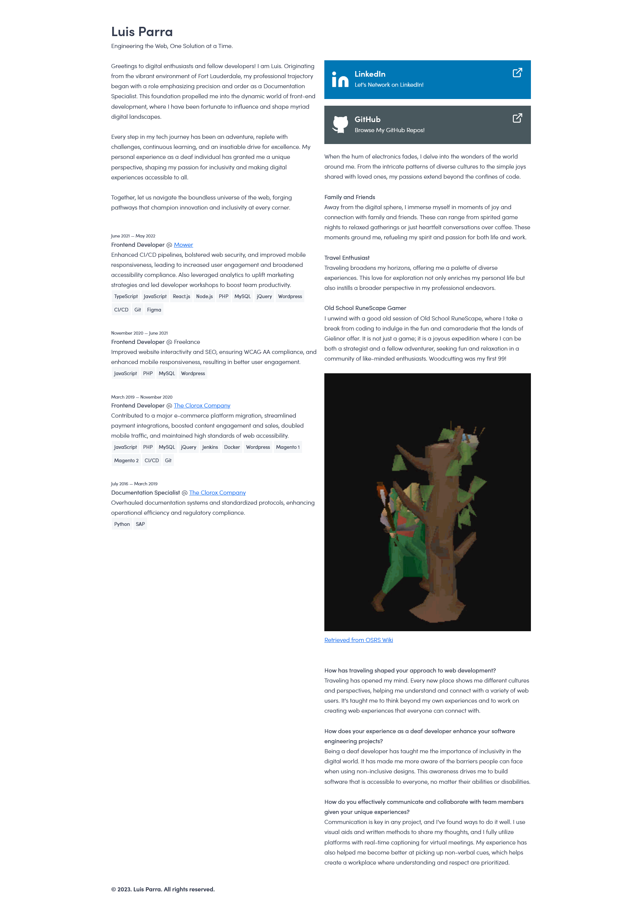

# My Personal Website

  

## Features

- **Responsive Design**: With the integration of Sakura CSS, the website provides a seamless experience across various devices and screen sizes.
- **Accessible**: The website has been designed with accessibility in mind, following best practices.
- **Lightweight**: The site is lightweight and quick to load.

## Project Structure

```bash
luisparra.dev
│   .gitignore
│   index.html
│   LICENSE.md
│   main.js
│   package-lock.json
│   package.json
│   README.md
│   screenshot.jpg
│
├───public
│
└───src
    ├───assets
    ├───scss
    ├───helpers
    ├───layouts
    │───sections
```

- **/src/**: This directory has all the assets, helpers, layouts, and sections.

## Getting Started

1. Clone the repository:

   ```
   git clone https://github.com/lsprr/luisparra.dev.git
   ```

2. Navigate to the project directory:

   ```
   cd luisparra.dev
   ```

3. Install the required dependencies:

   ```
   npm install
   ```

4. Run the development server:

   ```
   npm run dev
   ```

## Scripts

- **dev**: Runs the application in development mode.
- **build**: Builds the application for production.
- **preview**: Starts the application in preview mode.

## Dependencies

- **Vite**: A build tool for modern web projects.
- **SASS**: A preprocessor scripting language that is interpreted or compiled into CSS.

For complete dependency versions and additional details, refer to the `package.json` file.

## Contribute

Pull requests are welcome. For significant changes, please open an issue first to discuss what you'd like to adjust.

## License

This project is licensed under the MIT License. For more details, refer to the `LICENSE.md` file.

## Author

This project is proudly created by [Luis Parra](https://github.com/lsprr).

## Links

- [GitHub](https://github.com/lsprr/luisparra)
- [Live Site](https://www.luisparra.dev)
