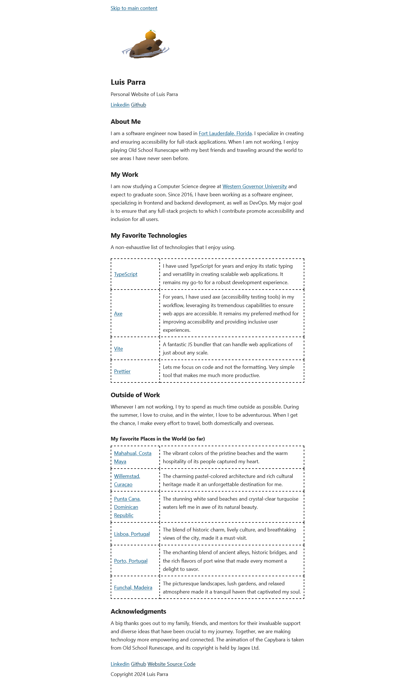

# Luis Parra's Personal Website

Welcome to the repository for my personal website. This project is a unique, personal space designed and developed to showcase my work, views, and skills. This modern web application is built with TypeScript, Next.js, React, and SASS for a sleek design, providing an intuitive user experience and a responsive design.

  

## Features

- **Responsive Design**: With the integration of pico.css, the website provides a seamless experience across various devices and screen sizes.
- **Accessible**: The website has been designed with accessibility in mind, following best practices.
- **Search Engine Optimized**: Built with Next.js, the site offers excellent SEO capabilities out-of-the-box.
- **Lightweight**: The site is lightweight and quick to load.

## Project Structure

```bash
luisparra.dev
│   .eslintrc.json
│   .gitignore
│   LICENSE.md
│   next.config.js
│   package-lock.json
│   package.json
│   postcss.config.js
│   README.md
│   tailwind.config.js
│   tsconfig.json
│
├───public
│   └───assets
│       ├───image
│       └───svg
│
└───src
    ├───components
    │   └───sections
    │
    ├───pages
    │
    └───styles
```

- **/public**: This directory contains static resources like images and SVGs.
- **/src/components**: This directory holds reusable React components.
- **/src/pages**: This directory has all the Next.js pages.
- **/src/sass**: This directory contains global SASS styles.

## Getting Started

1. Clone the repository:
   ```
   git clone https://github.com/lsprr/luisparra.dev.git
   ```
2. Navigate to the project directory:
   ```
   cd luisparra.dev
   ```
3. Install the required dependencies:
   ```
   npm install
   ```
4. Run the development server:
   ```
   npm run dev
   ```

## Scripts

- **dev**: Runs the application in development mode.
- **build**: Builds the application for production.
- **start**: Starts the application in production mode.
- **lint**: Lints the application code.

## Dependencies

- **Next.js**: A JavaScript framework for building server-rendered or statically exported React apps.
- **React & React DOM**: JavaScript libraries for building user interfaces.
- **TypeScript**: A typed superset of JavaScript that compiles to plain JavaScript.
- **Framer Motion**: A motion library for creating animations in React applications.
- **Sharp**: A Node.js module for image processing.
- **SASS**: A preprocessor scripting language that is interpreted or compiled into CSS.

For complete dependency versions and additional details, refer to the `package.json` file.

## Contribute

Pull requests are welcome. For significant changes, please open an issue first to discuss what you'd like to adjust.

## License

This project is licensed under the MIT License. For more details, refer to the `LICENSE.md` file.

## Author

This project is proudly created by [Luis Parra](https://github.com/lsprr).

## Links

- [GitHub](https://github.com/lsprr/luisparra.dev)
- [Live Site](https://www.luisparra.dev)

Enjoy the exploration of my digital universe!